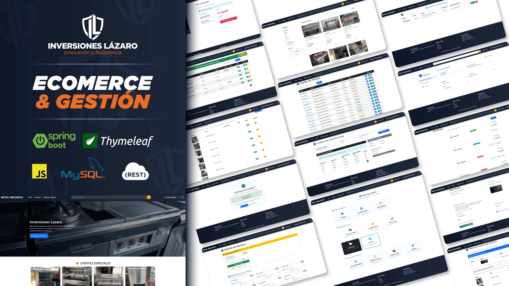
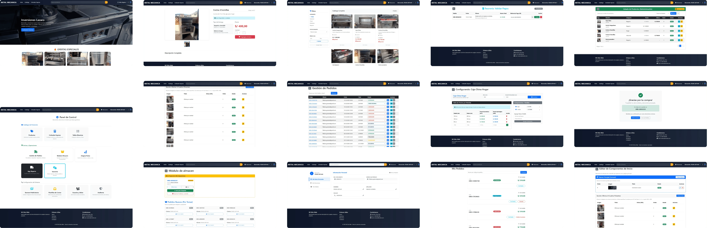

# Inversiones Lázaro - Plataforma Web

<div align="center">
  
</div>

> **Sistema integral de gestión de ventas, cotizaciones a medida y logística para metalmecánica.**

## Descripción

**Inversiones Lázaro** es una solución web empresarial ("Metalmecánica ERP") desarrollada bajo arquitectura Java Spring Boot. 

El sistema fusiona dos mundos:
1.  **Front-Office (B2C):** Un E-commerce moderno donde los clientes compran productos de catálogo o utilizan un **Cotizador Paramétrico** para solicitar productos a medida (hornos, cajas chinas, etc.) calculando precios en tiempo real según dimensiones y materiales.
2.  **Back-Office (ERP):** Un panel administrativo para la gestión de inventarios, despacho (asignación de choferes y rutas), finanzas, auditoría de usuarios y contenido web (CMS).

---

## Vistas

La interfaz está diseñada para ser responsiva y fácil de usar.

<div align="center">
  
</div>

---

## Stack Tecnológico

El proyecto utiliza tecnologías modernas, robustas y tipadas.

| Área | Tecnología | Descripción |
| :--- | :--- | :--- |
| **Backend** | **Java 17** | Lenguaje principal (LTS). |
| **Framework** | **Spring Boot 3.5.5** | Núcleo de la aplicación. |
| **Seguridad** | **Spring Security 6** | Autenticación, roles (ADMIN/USER) y protección CSRF. |
| **Base de Datos** | **MySQL 8** | Motor de base de datos relacional. |
| **Persistencia** | **Spring Data JPA** | ORM para manejo de datos y repositorios. |
| **Frontend** | **Thymeleaf** | Motor de plantillas renderizado en servidor. |
| **Estilos** | **Bootstrap 5** | Framework CSS para diseño responsivo. |
| **Pagos** | **Stripe API** | Procesamiento seguro de tarjetas de crédito/débito. |
| **Reportes** | **OpenPDF / Apache POI** | Generación de PDFs y Excel. |
| **Utils** | **Lombok** | Reducción de código repetitivo (Getters/Setters). |

---

## Funcionalidades

### Módulo Cliente
* **Catálogo Interactivo:** Filtrado por categorías, marcas y tipos.
* **Cotizador Personalizado:** Algoritmo que calcula precio base + material + mano de obra según las medidas (Alto x Ancho x Largo) ingresadas por el usuario.
* **Carrito de Compras:** Persistencia de ítems y checkout.
* **Pasarela de Pagos:** Integración real con Stripe.
* **Validación de Identidad:** Conexión con **APIPeruDev** para auto-completar datos de DNI/RUC.

### Módulo Administrativo
* **Dashboard:** Gráficos estadísticos de ventas e ingresos.
* **Gestión de Pedidos:** Flujo de estados (*Pendiente -> Confirmado -> En Ruta -> Entregado*).
* **Logística:**
    * Gestión de Almacenes.
    * Registro de Choferes y unidades de transporte.
    * Asignación de despachos.
* **CMS (Home Editor):** Permite cambiar banners, textos y secciones del inicio sin tocar código.
* **Auditoría:** Registro inmutable de acciones críticas (quién hizo qué y cuándo).
* **Finanzas:** Reportes de ingresos y validación de pagos.

---

## Base de Datos y SQL

El proyecto incluye la estructura y datos semilla necesarios.

### Ubicación de Scripts
Dentro de la carpeta `/databaseSQL/` encontrarás los scripts de respaldo:
* `inversioneslazaro_productos.sql`: Catálogo inicial.
* `inversioneslazaro_usuarios.sql`: Usuarios base (Admin/Cliente).
* `inversioneslazaro_ventas.sql`: Datos de prueba de transacciones.
* *(y otros archivos para configuración, auditoría, etc.)*

### Estrategia de Creación
El proyecto está configurado con `spring.jpa.hibernate.ddl-auto=update`.
> **Nota:** Al iniciar la aplicación por primera vez, Hibernate creará las tablas automáticamente si no existen. Luego puedes importar los `.sql` para poblar la data.

---

## Instalación y Configuración

### 1. Requisitos Previos
* Java JDK 17
* Maven
* MySQL Server

### 2. Configuración de Base de Datos
Crea una base de datos vacía en tu motor MySQL:
```sql
CREATE DATABASE inversioneslazaro;

continuando en prcoeso
